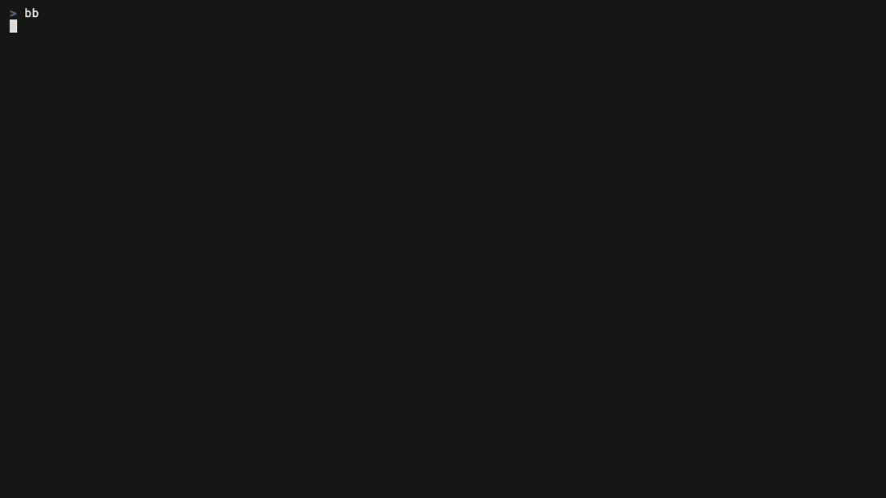

# bb

`bb` is a keyboard-first bead board for [Beads](https://github.com/steveyegge/beads). It turns a Beads workspace into a fast terminal board, tree, relationship view, activity stream, and agent-facing MCP server.



## Install

You need:

- macOS or Linux
- Go 1.26.5 or newer
- `bd` on `PATH` (tested with `bd` 1.1.0)

```sh
go install github.com/awhitty/bb@latest
bb --help
```

Open a terminal in any Beads workspace and run:

```sh
bb
```

Use another workspace without changing directories:

```sh
BB_WORKSPACE=/path/to/project bb
```

`bb` is not currently supported on Windows. Its process management uses Unix session semantics, and CI covers current macOS and Linux runners.

## What it does

- Multi-column status board, compact list, hierarchy tree, relationship swimlanes, and Finder-style columns
- Issue detail, comments, history, blockers, dependents, children, and siblings
- Live refresh when another process changes the Beads workspace
- Natural-language filters and whole-board questions through an optional local OpenAI-compatible model server
- A loopback MCP server that lets an agent inspect the board, publish a named view, emphasize cards, and reprioritize an issue
- Optional Claude Code hooks that show which beads an active agent is discussing

The board reads and writes through `bd` for ordinary issue operations. The activity view also reads Beads' local Dolt history directly when it is available.

## First keys

Press `?` inside the app for the complete key map.

| Key | Action |
| --- | --- |
| `j` / `k` or arrows | move |
| `enter` | open the focused issue or relationship |
| `esc` | go back |
| `1` / `2` / `3` / `4` | board / tree / list / activity |
| `c` | Finder-style columns |
| `/` | filter with a `bd` query |
| `?` | ask in natural language when models are available; otherwise show help |
| `@` | browse views shared by agents |
| `T` | toggle light and dark themes |
| `q` | quit |

## Commands

```text
bb                         open the board
bb status                  show model, MCP, and storage resolution
bb hook install            install Claude Code activity hooks
bb hook uninstall          remove those hooks
bb mcp install             register the live board with Claude Code
bb mcp uninstall           remove that registration
bb mcp-serve               run a read-only MCP server over stdio
bb version                 print the installed version
bb --help                  show command help
```

## Local models

Models are optional. The board, tree, relationships, activity, and MCP tools work without them.

At startup, `bb` probes local OpenAI-compatible servers, including `omlx` and Ollama, and chooses a small compiler model plus a larger analyst model from what the server actually exposes. If no server answers, `omlx` is installed, and autostart is enabled, `bb` starts `omlx serve` in the background. Set this in `~/.config/bb/config.toml` to disable that behavior:

```toml
[autostart]
enabled = false
```

Run `bb status` to see the resolved URL, model names, key source, timing, MCP endpoint, and local file locations. Keys discovered from `omlx` remain in its settings file; `bb` stores the path to that file rather than copying the key into its config.

Explicit overrides win over discovery:

| Variable | Purpose |
| --- | --- |
| `BB_NLQ_URL` | compiler server base URL |
| `BB_NLQ_MODEL` | compiler model |
| `BB_NLQ_KEY` | compiler bearer token |
| `BB_ANALYST_URL` | analyst server base URL |
| `BB_ANALYST_MODEL` | analyst model |
| `BB_ANALYST_KEY` | analyst bearer token |
| `BB_NLQ_LOG` | feedback log path |
| `BB_CONFIG_DIR` | config and private state directory |
| `BB_MCP_PORT` | live MCP loopback port |
| `BB_THEME` | initial theme: `dark`, `light`, `notty`, `ascii`, or `auto` |
| `BB_LOG` | private diagnostic log path |
| `BB_WORKSPACE` | Beads workspace path |

## MCP

The running board exposes Streamable HTTP MCP on `127.0.0.1:7317` by default. It uses a persistent bearer token stored owner-only in `~/.config/bb/config.toml`. Register it with Claude Code once:

```sh
bb mcp install
```

Keep `bb` running while an agent drives the visible board. Read tools do not move the screen. View tools publish named, reversible arrangements into the agent-share stream; they do not seize the current screen. The only issue mutation available through this server is priority.

For headless, read-only access over stdio:

```sh
claude mcp add bb -- bb mcp-serve
codex mcp add bb -- bb mcp-serve
```

The headless server exposes schema, search, issue lookup, exact query, and relationship traversal. It cannot change issue data.

## Hooks and privacy

Hooks are off by default. `bb hook install` changes `~/.claude/settings.json` by adding Claude Code `Stop` and `SessionEnd` hooks that invoke the installed `bb` binary. `bb hook uninstall` removes only the entries managed by `bb`.

The `Stop` hook reads the current local Claude transcript, extracts the latest assistant text, matches real bead IDs from the current workspace, and sends these items to the loopback MCP server:

- the matched IDs
- short excerpts around those IDs
- a short snippet of the assistant turn
- a conversation name derived from local transcript data
- the Claude session ID

The `SessionEnd` hook marks that channel archived. Hook requests never leave the machine through `bb`, and a missing board is a silent no-op. The resulting activity and shared-view state persists locally in `sessions.json` until you remove it.

Natural-language feedback can contain the questions you typed and the compiled queries that ran. Treat it as private user content.

`bb` stores these files under `~/.config/bb` unless `BB_CONFIG_DIR` overrides it:

| File | Contents |
| --- | --- |
| `config.toml` | model choices, key-file path, autostart setting, MCP port and token |
| `mcp.json` | current loopback URL, process ID, and bearer token |
| `sessions.json` | local agent-channel names, snippets, excerpts, IDs, and shared views |
| `nlq-feedback.jsonl` | natural-language questions, compiled queries, results, and feedback |
| `omlx.log` | output from an `omlx` server started by `bb` |

Config, state, feedback, and diagnostic logs created by `bb` are owner-only (`0600`); the config directory is owner-only (`0700`). A path supplied through `BB_LOG` or `BB_NLQ_LOG` is also tightened to `0600` when opened.

See [SECURITY.md](SECURITY.md) for the local trust boundary and vulnerability reporting.

## Development

```sh
go mod tidy
go mod verify
go vet ./...
go test ./...
go test -race ./...
go build ./...
```

Regenerate the README animation from the deterministic fixture with Charm VHS:

```sh
./scripts/demo.sh
```

The live Dolt integration test is opt-in because it needs a real Beads workspace:

```sh
BEADS_DOLT_LIVE=1 BB_WORKSPACE=/path/to/project go test ./internal/dolt -run Live
```

## License

MIT. See [LICENSE](LICENSE).
